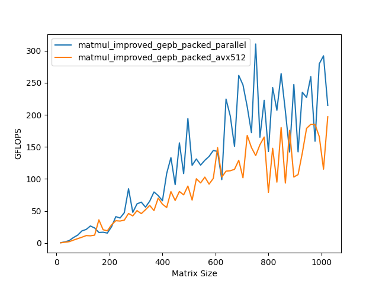

# Matrix Multiplication Optimizations

## Introduction

In this project, we will explore various optimizations for matrix multiplication. We will begin by implementing a native matrix multiplication algorithm and then introduce optimizations to improve its performance. We will evaluate the effectiveness of these optimizations by comparing the GFLOPS achieved by each implementation.

## Environment

1. Platform used:
    - Intel(R) Xeon(R) Gold 6240 CPU @ 2.60GHz, with 128 GB RAM (default)
    - AMD Ryzen 9 5900X 12-Core Processor, with 8 GB RAM
2. Compiler: GCC 11.4.0
3. Operating System: Ubuntu 22.04 LTS
4. Libraries:
    - OpenMP: 5.0
    - OpenBLAS: 0.3.27
    - MPI: 4.0.3
    - Google Benchmark: 1.8.3

## Analysis

In a Von Neumann architecture, the CPU and memory are separate entities, and data must be transferred between them for processing. This data transfer can be a bottleneck in matrix multiplication, as it involves reading and writing large amounts of data and the transfer speed is far slower than the processing speed of the CPU. To optimize matrix multiplication, we need to minimize the amount of data transferred between the CPU and memory. The most common optimization techniques is to decrease the number of cache misses and improve data locality.

## Optimization Techniques

1. Blocking: Splitting the matrices into smaller blocks that fit into the cache, allowing for better data reuse and reducing cache misses.
2. SIMD (Single Instruction, Multiple Data): Using vector instructions to perform multiple operations in parallel on a single core.
3. Multithreading: Utilizing multiple threads to perform matrix multiplication concurrently, taking advantage of multiple cores.

## Optimization Process

In this project, we will evaluate the performance of the optimizations on different sizes of matrices (from 16\*16 to 1024\*1024, with a step length of 16). We will also use matrix sizes that up to 65536*65536, but only for several well-optimized implementations as it is impractical to run all optimizations on such large matrices.

1. **Native Implementation:** Implement a simple matrix multiplication algorithm without any optimizations.

    

2. **Pointer Optimization:** Optimize the native implementation by simplifying the matrix access using pointers. For example, instead of using `a->data`, we can create a pointer `a_data` and use `a_data` instead.

    

    From the figure above, we can see taht although we have set `-O3` optimization level, this simple optimization still slightly improves the performance of the native implementation. Therefore, even the compiler is much cleverer than most of programmers, it might still miss some optimization opportunities.

3. **Reorder Optimization:** Optimize the matrix multiplication algorithm by reordering the loops to improve data locality and reduce cache misses.

    

    In the native implementation, the order of the loops is `i`, `j`, `k`, that is, the innermost loop is `k`. This order is not cache-friendly, as `k` refers row index of the second matrix. The way we store the matrix in memory is row-major, so hardwares will read the matrix row by row. For instance, if we access `b[i][j]`, the hardware will move elements from `b[i][0]` to `b[i][n]` to cache. If we access `b[i+1][j]`, the remianing elements in the cache will be useless. Therefore, we should change the order of the loops to `i`, `k`, `j`, so that the innermost loop is `j`. This way, the hardware will read the matrix column by column, which is more cache-friendly. The result also shows that this optimization significantly improves the performance of the native implementation.

4. **SIMD Optimization:** Optimize the matrix multiplication algorithm using SIMD instructions to perform multiple operations in parallel.

    

    SIMD instructions allow us to perform the same operation on multiple data elements simultaneously. In this optimization, we use SIMD instructions to perform multiple additions and multiplications in parallel. The benchmark results show that this optimization significantly improves the performance when the size of the matrices is under 512\*512.

5. **Blocking Optimization:** Optimize the matrix multiplication algorithm by splitting the matrices into smaller blocks that fit into the cache.

    

    When the matrices are too large to fit into the cache, cache misses will occur frequently, leading to a significant performance drop. To mitigate this issue, we can split the matrices into smaller blocks that fit into the cache and perform matrix multiplication on these blocks. The figure above shows that the performance on matrices of size larger than 512\*512 decreases less than the previous optimizations.

6. **OpenMP Optimization:** Optimize the matrix multiplication algorithm using OpenMP to parallelize the computation across multiple threads.

    

    OpenMP is a popular API for parallel programming in C/C++. It can automatically distribute the work across multiple threads, taking advantage of multiple cores. The benchmark results show that this optimization significantly improves the performance. The larger the size of the matrices, the more profit we can get from this optimization.
    However, it still have some drawbacks. First, when the size of the matrices is small, the overhead of creating and managing threads may outweigh the benefits of parallelization. Second, the stability of the performance is not good. This might due to the data race, which is a common issue in parallel programming. When this occurs, the threads have to wait for each other, which will decrease the performance.

7. **New Blocking Optimization:** Optimize the matrix multiplication algorithm using a new blocking technique GEPB.

    

    According to the paper "Anatomy of High-Performance Matrix Multiplication", the GEPB blocking technique can achieve better performance for a row major matrix. It divides the left matrix into strips and the right matrix into panels, and then performs matrix multiplication on these blocks.

8. **Packing Optimization:** Optimize the matrix multiplication algorithm by packing the incontinuous memory into continuous memory.

    

    As I have mentioned before, GEPB will divide the right matrix into panels. However, the elements in the panel are not continuous in memory. This will lead to cache misses when we access the elements in the panel. To mitigate this issue, we can allocate a continuous memory space for the panel and copy the elements from the original matrix to the new space.

9. **More Packing Optimization:** Optimize the matrix multiplication algorithm by packing all the incontinuous memory in a chunk into continuous memory.

    
    
    In the previous optimization, I only pack the panel of the right matrix. However, the left matrix is also divided into strips ordered by rows, and the program writes the result in the same order. Therefore, I also pack the strips of the left matrix and the result into continuous memory.
    
10. **OpenBLAS:** Compare optimization with OpenBLAS.

	
	
    
    
    

## Further Tests

1. **Tuning Packing Size:** Optimize the matrix multiplication algorithm by tuning the size of the packed memory.

    

     For convenience, I simply set the size of the packed memory to 16. However, the optimal size of the packed memory may vary with the size of the matrices. Therefore, the program can tune the size of the packed memory to achieve better performance. From the hotspots map, we can see that when the chunk size is 32\*512, the performance is the best. However, to use this optimization, we need to deal with the edge cases, which is not that easy and might introduce overhead.

2. **MPI Optimization:** Optimize the matrix multiplication algorithm using MPI to parallelize the computation across multiple nodes.

    

    I choose to modify the simple blocking optimization(`matmul_improved_parallel`) to use MPI, as it is not that easy to manually parallelize the GEPB blocking technique. The result shows that the performance of the MPI optimization is several times better than the OpenMP optimization. This might due to the fact that MPI uses processes instead of threads, whose variables are independent of each other. Therefore, the program will encounter less data race and save the time of waiting for each other.

3. **Resources Usage:** Monitor the CPU and memory usage of the optimized implementations.

    | Matrix size = 65536\*65536            | CPU Usage | Memory Usage |
    | ------------------------------------ | --------- | ------------ |
    | matmul_improved_gepb_packed_parallel | 4523%     | 48G          |
    | OpenBLAS                             | 3749%     | 64.4G        |

    Although the GEPB optimization achieves excellent performance, as it requires more memory for packing, it consumes extra one matrix size memory. Besides, the CPU utilization of my program is not that high, compared to the OpenBLAS library.

    

    The difference between the CPU time and real time represents the time spent on waiting for the memory. The figure above shows that the GEPB optimization a the unstable waiting time compared to the OpenBLAS library, and the waiting time of OpenBLAS is nearly zero, representing it's efficient memory access.
    
4. **Modern SIMD:** Optimize the matrix multiplication algorithm using the AVX-512 instruction set.

    

    The AVX-512 instruction set is an extension of the x86 instruction set architecture that introduces 512-bit SIMD instructions. These instructions allow for even more parallelism than the previous SIMD instructions, resulting in faster matrix multiplication. The benchmark results show that the performance of the AVX-512 optimization is better than the previous SIMD optimization.

    

    When I use the AVX-512 in mutithreading, the things goes different. The performance of the AVX-512 optimization is worse than the previous SIMD optimization. This might due to the fact that the AVX-512 instruction needs more power and the CPU is not able to handle the power consumption of the AVX-512 instruction set, or the AVX-512 instruction fetches more data to cache, which leads to more cache misses.

## Conclusion

In the first half of the project, I followed the optimization mentioned in Lab, such as SIMD and OpenMP. However, the performance of the optimized implementations is not as good as I expected. Therefore, I searched for more optimization techniques and found the GEPB blocking technique. By using a new blocking technique and packing the incontinuous memory into continuous memory, I achieved a significant performance improvement. The performance of the optimized implementations is much better than the native implementation.

## References

1. [Anatomy of High-Performance Matrix Multiplication](https://dl.acm.org/doi/pdf/10.1145/1356052.1356053)
2. [如何加速矩阵乘法——优化GEMM (CPU单线程篇) | 鸿雁自南人自北 (renzibei.com)](https://renzibei.com/2021/06/30/optimize-gemm/)
2. [SGEMM(单核通用矩阵乘法加速) - 知乎 (zhihu.com)](https://zhuanlan.zhihu.com/p/684812336)