# Report

## Environment

- OS: Ubuntu 22.04
- CUDA: 12.4
- GPU: RTX 2080Ti
- CPU: Intel(R) Xeon(R) Gold 6240 CPU @ 2.60GHz
- Compiler: g++ 11.4.0, nvcc 12.4

## Task 1

Simply modify the code in `addKernel` function to `output[i] = input1[i] + alpha * input2[i] + beta;` and the goal is achieved.

## Task 2

Use `cublasSgemm` to perform matrix multiplication.

### Performance Comparison

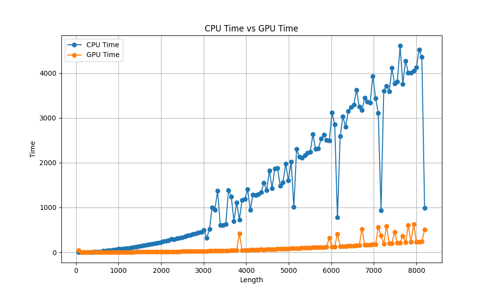

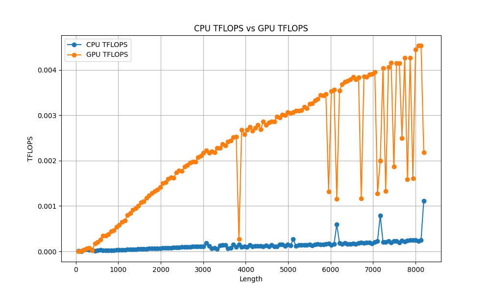

From the above figures, we can see that the performance of `cublasSgemm` is much better than the `cblas_sgemm` in the CPU. Its TFLOPS is keeping increasing with the size of the matrix, while the CPU's performance is almost constant. besides, both of their performance changes sharply at some points. For CPU, the performance increases dynamically when the length of the matrix is multiples of 1024, and the improvement more significant as the size of the matrix increases. This might be caused by the cache mechanism of the CPU. For GPU, the performance sometimes drops sharply and those points are irregular. Because the CUDA is not open-source, I can't figure out a exact reason for this.

## Task 3

In this task, I tried to use GPU to perform the list sorting.

As is commonly understood, the GPU is constituted of numerous cores, each capable of executing identical operations on disparate datasets. Consequently, the optimal sorting methodology for the GPU diverges from that of the CPU. Within this context, a tolerance for certain computational overhead becomes permissible to augment parallelism. Consequently, conventional serial sorting algorithms such as selection sort or bubble sort are deemed impractical. Instead, algorithms characterized by a divide-and-conquer paradigm, such as quicksort or mergesort, emerge as more conducive to parallel processing. In this approach, individual threads undertake the sorting of parts of the dataset, facilitating subsequent merging operations to yield the final sorted result.

### Before Starting

Before beginning the implementation, I realize I need to consider manual memory management, similar to what I learned with matrix multiplication. However, an official NVIDIA document indicates that the hardware is designed to reduce the overhead associated with certain memory access patterns, like misaligned access. Additionally, the data we plan to sort is too large to fit in shared memory, so I won't need to focus extensively on memory management.

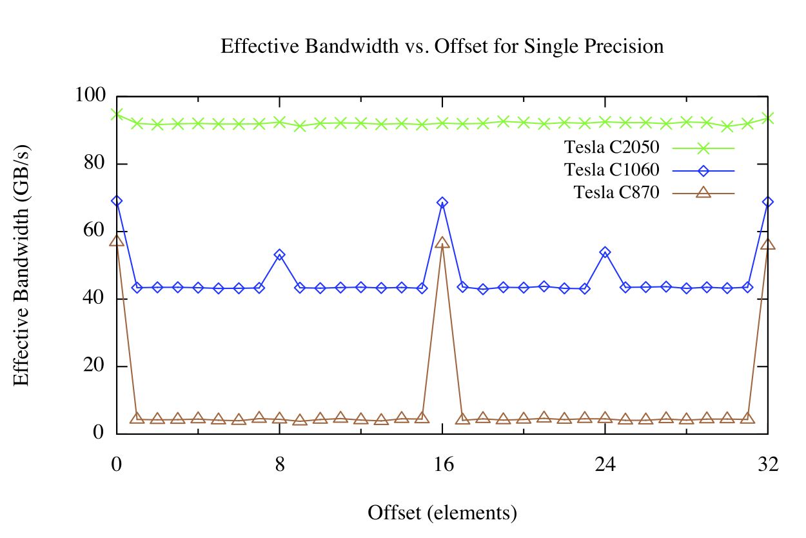

### Simple Quicksort

At first, I tried to implement the quicksort algorithm on the GPU, as mergesort is more complex and needs more memory.

```c++
void quicksort_cuda_cell(T *arr, size_t left, size_t right) {
  //. . .
  
  cudaMalloc(&d_arr, sizeof(T) * size);
  cudaMemcpy(d_arr, arr + left, sizeof(T) * size, cudaMemcpyHostToDevice);

  partition_proxy<<<1, 1>>>(d_arr, 0, size - 1, d_pivot);
  GPU_ERR_CHK(cudaGetLastError());
  
  size_t pivot;
  cudaMemcpy(&pivot, d_pivot, sizeof(size_t), cudaMemcpyDeviceToHost);
  cudaMemcpy(arr + left, d_arr, sizeof(T) * size, cudaMemcpyDeviceToHost);

  quicksort_cuda_cell(arr, left, left + pivot - 1);
  quicksort_cuda_cell(arr, left + pivot, right);

  //. . .
}
```

I compared its performance with a plain quicksort on the CPU, as `std::sort` in the C++ STL is already optimized and hard to beat.

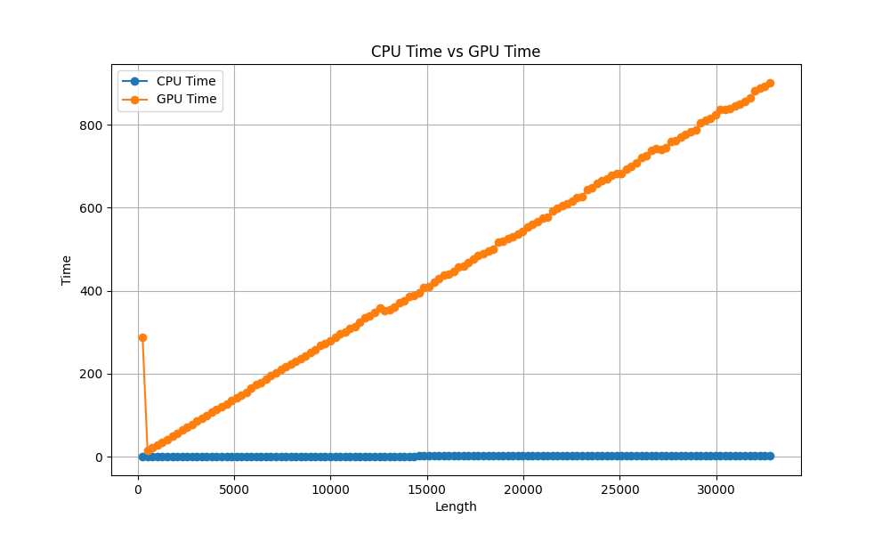

Based on the provided diagram, it becomes evident that the efficiency of GPU quicksort notably lags behind that of CPU quicksort. This discrepancy arises primarily due to the limited degree of parallelism inherent in GPU quicksort. While CPUs can proceed independently of kernel function completion, GPUs must tackle such functions sequentially, thereby rendering the partitioning step inherently serial. Furthermore, the transfer of memory between host and device poses an additional bottleneck to overall performance.

```shell
==622620== Profiling result:
            Type  Time(%)      Time     Calls       Avg       Min       Max  Name
 GPU activities:   50.98%  3.27999s   1048575  3.1280us  1.0550us  74.169ms  void partition_proxy<float>(float*, unsigned long, unsigned long, unsigned long*)
                   41.81%  2.69012s   2097150  1.2820us     448ns  1.0597ms  [CUDA memcpy DtoH]
                    7.21%  464.04ms   1048575     442ns     319ns  643.84us  [CUDA memcpy HtoD]
      API calls:   59.49%  22.8968s   3145725  7.2780us  2.3030us  74.184ms  cudaMemcpy
                   14.94%  5.74958s   2097150  2.7410us  1.7100us  214.89ms  cudaMalloc
                   12.81%  4.92897s   2097150  2.3500us  1.4820us  506.97us  cudaFree
                   12.43%  4.78199s   1048575  4.5600us  3.3090us  528.95us  cudaLaunchKernel
```

### Use Dynamic Parallelism

Typically, kernel functions are only callable by the host, making the primary bottleneck the memory transfer between the host and the device. Upon consulting the CUDA documentation, I discovered that dynamic parallelism allows kernel functions to invoke other kernel functions. Enabling this feature is by adding `rdc=true` to the compiler flags. This approach can significantly reduce the need for frequent memory transfers between the host and the device.

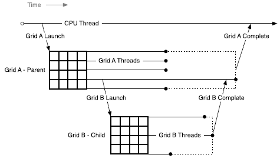

```c++
template <typename T>
__global__ void quicksort_cuda_rdc_cell(T *arr, size_t left, size_t right,
                                        size_t depth) {
  if (left >= right)
    return;
  if (depth <= 0) {
    selection_sort(arr, left, right);
    return;
  }
  size_t pivot;
  partition(arr, left, right, &pivot);
  quicksort_cuda_rdc_cell<<<1, 1>>>(arr, left, pivot - 1, depth - 1);
  quicksort_cuda_rdc_cell<<<1, 1>>>(arr, pivot, right, depth - 1);
}
```

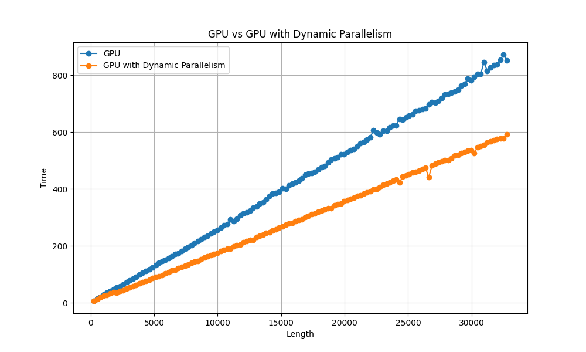

The performance of dynamic parallelism in quicksort surpasses that of the conventional quicksort, yet remains unremarkable. Additionally, it appears that `nvprof` is unable to profile the kernel functions associated with dynamic parallelism, precluding the acquisition of detailed information. Nonetheless, memory copy operations continue to represent a significant bottleneck.

```shell
==622483== Profiling result:
            Type  Time(%)      Time     Calls       Avg       Min       Max  Name
 GPU activities:   98.02%  85.052ms         1  85.052ms  85.052ms  85.052ms  void quicksort_cuda_rdc_cell<float>(float*, unsigned long, unsigned long, unsigned long)
                    1.26%  1.0909ms         1  1.0909ms  1.0909ms  1.0909ms  [CUDA memcpy DtoH]
                    0.72%  623.46us         1  623.46us  623.46us  623.46us  [CUDA memcpy HtoD]
      API calls:   98.75%  19.2301s         2  9.61507s  743.78us  19.2294s  cudaMemcpy
                    1.10%  214.58ms         1  214.58ms  214.58ms  214.58ms  cudaMalloc
                    0.09%  17.303ms         1  17.303ms  17.303ms  17.303ms  cudaLaunchKernel
                    0.05%  10.315ms       456  22.619us      87ns  1.6639ms  cuDeviceGetAttribute
                    0.00%  228.31us         1  228.31us  228.31us  228.31us  cudaFree
```

The length of the list is 2^20, and the bandwidth of the PCIe is 16GB/s, so the time of the memory copy should be in 5 ms at worst, which is much less than the actual time.

### Use Streams

Despite the memory copy bottleneck, the dynamic parallelism of quicksort remains not fully parallel. To address this, streams can be employed to concurrently launch multiple kernel functions. Therefore, I attempted to utilize streams to simultaneously sort the left and right segments of the list.

```c++
template <typename T>
__global__ void quicksort_cuda_rdc_stream_cell(T *arr, size_t left,
                                               size_t right, size_t depth) {
  //. . .
  cudaStream_t l_stream, r_stream;
  if (left < pivot - 1) {
    cudaStreamCreateWithFlags(&l_stream, cudaStreamNonBlocking);
    quicksort_cuda_rdc_stream_cell<<<1, 1, 0, l_stream>>>(arr, left, pivot - 1,
                                                          depth - 1);
    cudaStreamDestroy(l_stream);
  }
  if (pivot < right) {
    cudaStreamCreateWithFlags(&r_stream, cudaStreamNonBlocking);
    quicksort_cuda_rdc_stream_cell<<<1, 1, 0, r_stream>>>(arr, pivot, right,
                                                          depth - 1);
    cudaStreamDestroy(r_stream);
  }
  //. . .
}
```

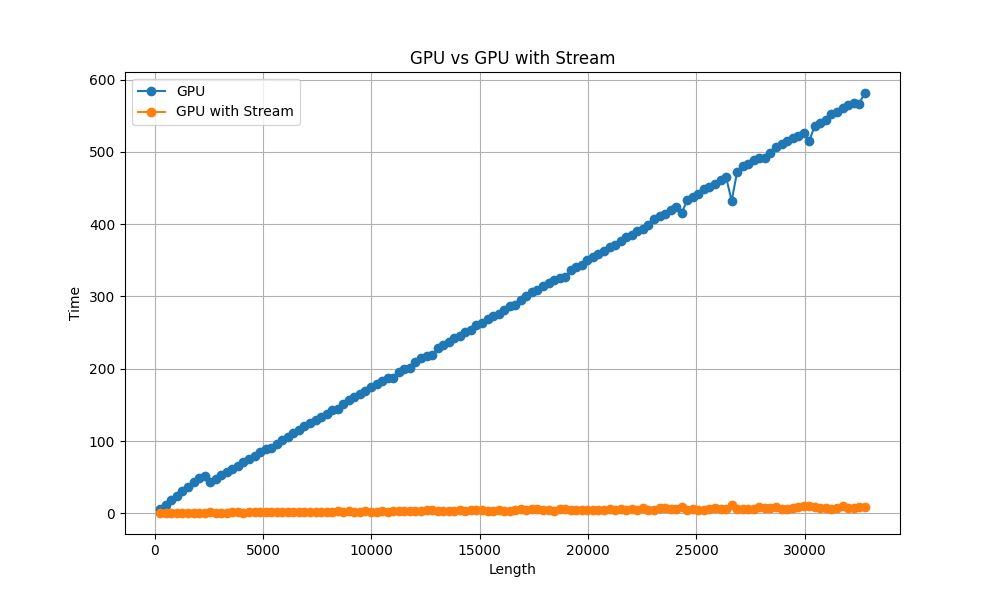

```shell
==623817== Profiling result:
            Type  Time(%)      Time     Calls       Avg       Min       Max  Name
 GPU activities:   98.40%  76.785ms         1  76.785ms  76.785ms  76.785ms  void quicksort_cuda_rdc_stream_cell<float>(float*, unsigned long, unsigned long, unsigned long)
                    0.81%  634.96us         1  634.96us  634.96us  634.96us  [CUDA memcpy DtoH]
                    0.78%  612.56us         1  612.56us  612.56us  612.56us  [CUDA memcpy HtoD]
                    0.00%  1.1830us         1  1.1830us  1.1830us  1.1830us  init(void)
      API calls:   60.74%  333.31ms         2  166.66ms  698.48us  332.61ms  cudaMemcpy
                   36.91%  202.55ms         2  101.28ms  29.912us  202.52ms  cudaLaunchKernel
                    2.28%  12.520ms       456  27.455us      87ns  1.7152ms  cuDeviceGetAttribute
                    0.04%  207.58us         1  207.58us  207.58us  207.58us  cudaFree
                    0.02%  127.32us         1  127.32us  127.32us  127.32us  cudaMalloc
```

Now the performance is much better than the previous two versions, and the memory copy is no longer the bottleneck. The function can be further optimized by using selection sort when the length of the list is small enough, but that is not the main goal of this task.

### CUDA Thrust

Thrust is a parallel algorithms library which is similar to the C++ STL. It provides many useful functions like sorting, scanning, and reducing. I tried to use the `thrust::sort` function to sort the list.

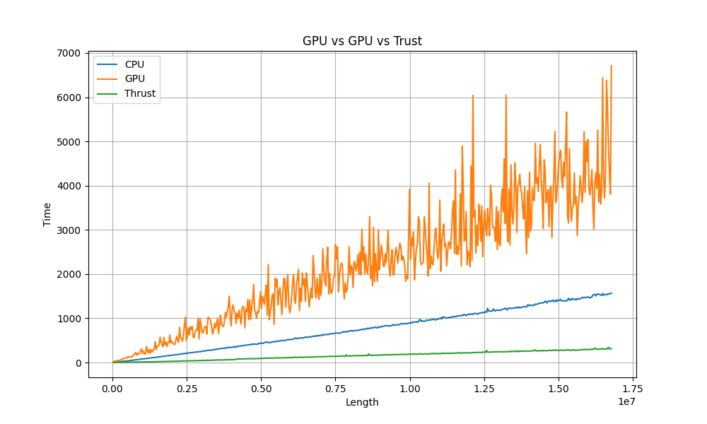

The Thrust sort algorithm demonstrates superior performance, surpassing that of the CPU-based quicksort. Although the library remains closed-source, discussions in online forums suggest that it employs the radix sort algorithm, which is more effectively optimized for GPU architectures.

### Bitonic Sort

The bitonic sort is another parallel sorting algorithm, I found it when I was searching for the implementation of the Thrust sort. It is a improved version of the merge sort, and can be implemented in a parallel way.

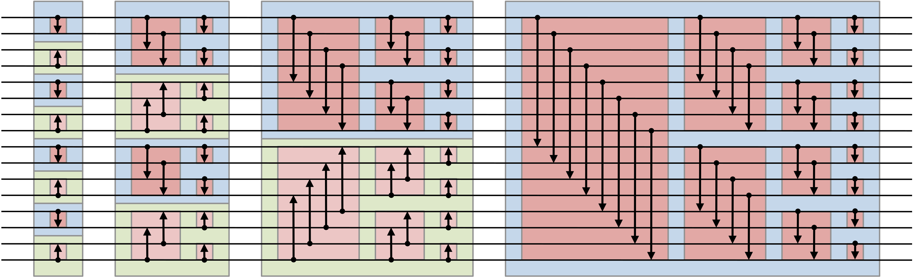

```c++
// given an array arr of length n, this code sorts it in place
// all indices run from 0 to n-1
for (k = 2; k <= n; k *= 2) // k is doubled every iteration
    for (j = k/2; j > 0; j /= 2) // j is halved at every iteration, with truncation of fractional parts
        for (i = 0; i < n; i++)
            l = bitwiseXOR (i, j); // in C-like languages this is "i ^ j"
            if (l > i)
                if (  (bitwiseAND (i, k) == 0) AND (arr[i] > arr[l])
                   OR (bitwiseAND (i, k) != 0) AND (arr[i] < arr[l]) )
                      swap the elements arr[i] and arr[l]
```

Above code is the pseudocode of the bitonic sort from the Wikipedia. The first two loops can be unrolled, and the third loop can be parallelized. The code can be implemented in CUDA as follows.

```c++
for (k = 2; k <= size; k <<= 1) {
  for (j = k >> 1; j > 0; j = j >> 1) {
    bitonicsort<<<blocksPerGrid, threadsPerBlock>>>(d_arr, j, k);
  }
}

template <typename T> __global__ void bitonicsort(T *arr, size_t j, size_t k) {
  size_t i = threadIdx.x + blockDim.x * blockIdx.x;
  size_t ij = i ^ j;
  if (ij > i) {
    if ((i & k) == 0) {
      if (arr[i] > arr[ij]) {
        swap(arr, i, ij);
      }
    } else {
      if (arr[i] < arr[ij]) {
        swap(arr, i, ij);
      }
    }
  }
}
```

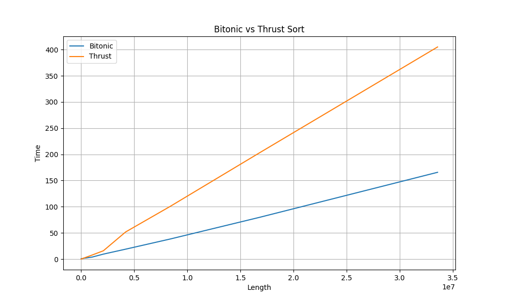

To my surprise, the performance of the bitonic sort is even better than the Thrust sort. The reason might be that Thrust sort is a general sorting algorithm.

### Support for non-power-of-two list

The bitonic sort algorithm is limited to sorting lists whose lengths are powers of two. There are two primary methods to address this limitation. The first method involves padding the list with special values to achieve the desired length. The second method recursively divides the list into segments of power-of-two lengths and non-power-of-two lengths. The atter approach appears more efficient, but for GPU, the increase of the threads will only lead to a slight overhead, and the second way might introduce more overhead to divide the list properly. Therefore, I chose the first way.

```c++
template <typename T>
__global__ void initialize_padding(T *arr, size_t size, size_t paddedSize,
                                   T maxVal) {
  size_t i = threadIdx.x + blockDim.x * blockIdx.x;
  if (i >= size && i < paddedSize) {
    arr[i] = maxVal;
  }
}

template <typename T> void bitonicsort(T *arr, size_t size) {
  size_t threadsPerBlock = 1024;
  size_t paddedSize = 1;
  while (paddedSize < size) {
    paddedSize <<= 1;
  }
  size_t blocksPerGrid = (paddedSize + threadsPerBlock - 1) / threadsPerBlock;
  T *d_arr;
  cudaMalloc(&d_arr, sizeof(T) * paddedSize);
  cudaMemcpy(d_arr, arr, sizeof(T) * size, cudaMemcpyHostToDevice);
  T maxVal = std::numeric_limits<T>::max();
  initialize_padding<<<blocksPerGrid, threadsPerBlock>>>(d_arr, size,
                                                         paddedSize, maxVal);
  //. . .
}
```

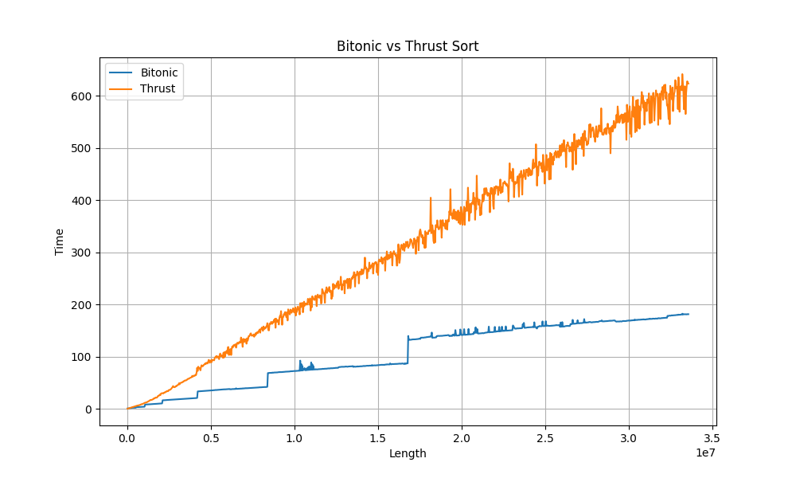

The performance of the bitonic sort with padding is slightly inferior to the original version. When the list size exceeds a power of two, performance declines significantly due to the overhead introduced by padding. Despite this drawback, the bitonic sort with padding still outperforms the Thrust sort.

### Summary

The bitonic sort algorithm is a highly efficient parallel sorting algorithm that can be implemented on the GPU. The algorithm's performance is even superior to that of the Thrust sort, and it can be further optimized by leveraging dynamic parallelism and streams. However, the algorithm is limited to sorting lists whose lengths are powers of two. To address this limitation, the list can be padded with special values to achieve the desired length. Although this approach introduces a slight overhead, the bitonic sort with padding remains more efficient than the Thrust sort.

## Reference

- [CUDA C Programming Guide (nvidia.com)](https://docs.nvidia.com/cuda/cuda-c-programming-guide/index.html#introduction-cuda-dynamic-parallelism)
- [Bitonic sorting network for n not a power of 2](https://hwlang.de/algorithmen/sortieren/bitonic/oddn.htm)
- [Bitonic sorter - Wikipedia](https://en.wikipedia.org/wiki/Bitonic_sorter)
- [Introduction to Dynamic Parallelism (nvidia.cn)](https://developer.download.nvidia.cn/GTC/PDF/GTC2012/PresentationPDF/S0338-GTC2012-CUDA-Programming-Model.pdf)
- [What is a good sorting algorithm on CUDA? - Stack Overflow](https://stackoverflow.com/questions/5288958/what-is-a-good-sorting-algorithm-on-cuda)
- [How to Access Global Memory Efficiently in CUDA C/C++ Kernels | NVIDIA Technical Blog](https://developer.nvidia.com/blog/how-access-global-memory-efficiently-cuda-c-kernels/)
